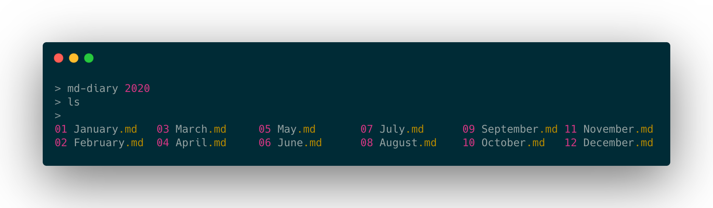

# markdown-diary

 

Diary file template generator, producing text files in [Markdown](https://en.wikipedia.org/wiki/Markdown) format.

I use this personally to keep a simple monthly diary of my notes and activities. Since it just produces a series of text files, they can be stored in something like Dropbox, and synced everywhere easily. 



## Installation
`pip install markdown-diary`

## How to use

`pip install` adds the command `md-diary` to your `/bin` PATH so you can run it directly from the command line.

Run `md-diary` for help.

### For a single month
Run `md-diary YYYY-mm` (e.g. `md-diary 2019-01`) which will create a file called `01 January.md`

The format looks like:

```
# January


## Week 1

### Tue 1


### Wed 2


### Thu 3


### Fri 4


## Week 2

### Mon 7


### Tue 8
...
```

### For a whole year

Like above, but run `md-diary YYYY` (e.g. `md-diary 20202`) which will create the files `01 January.md`, `02 February.md`, `...` in the current directory. 

### Options
Use the `-w` flag to output weekdays only.

## Dependencies

* Python 2.7 or 3.x
